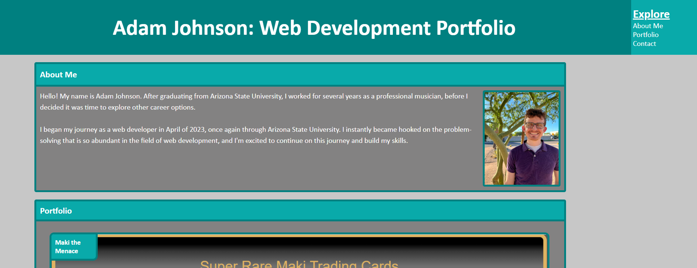

# Adam Johnson Portfolio
## Description

For this challenge, I built my own portfolio from scratch using html and css, keeping in mind that the layout needs to be responsive to screen/devise size as well as having functional navigation elements, both within the application and to destinations outside of the applicaiton. 

## Installation

N/A

## Usage

Potential employers and collaborators can now explore my portfolio to learn a little bit about me, and to explore work that I have done, including projects that I have done for my Full Stack Web Development Bootcamp as well as personal projects I have done on my own. The nav bar in the app's header will direct users to each of the appropriate sections: About Me, Portfolio, and Contact. Each item within the Portfolio section links to the deployed project that it refrences. For now, it is only the first two items. The first linking to a personal project, and the second links to a refactoring challenge completed for the bootcamp. The Contact section also contains links to my Github page as well as my LinkedIn page.  

[Adam Johnson's Deployed portfolio (https://adamjohnson92.github.io/Adam-Johnson-Portfolio/)]

## Credits

N/A

## License

N/A